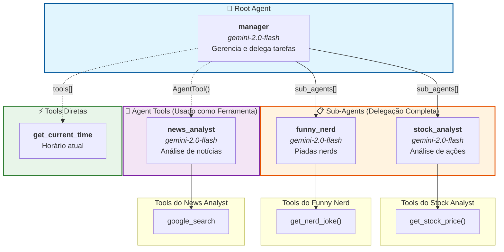
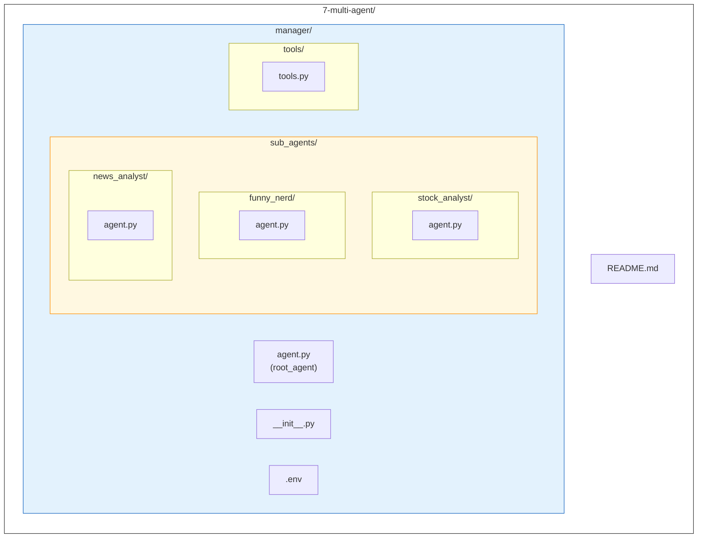
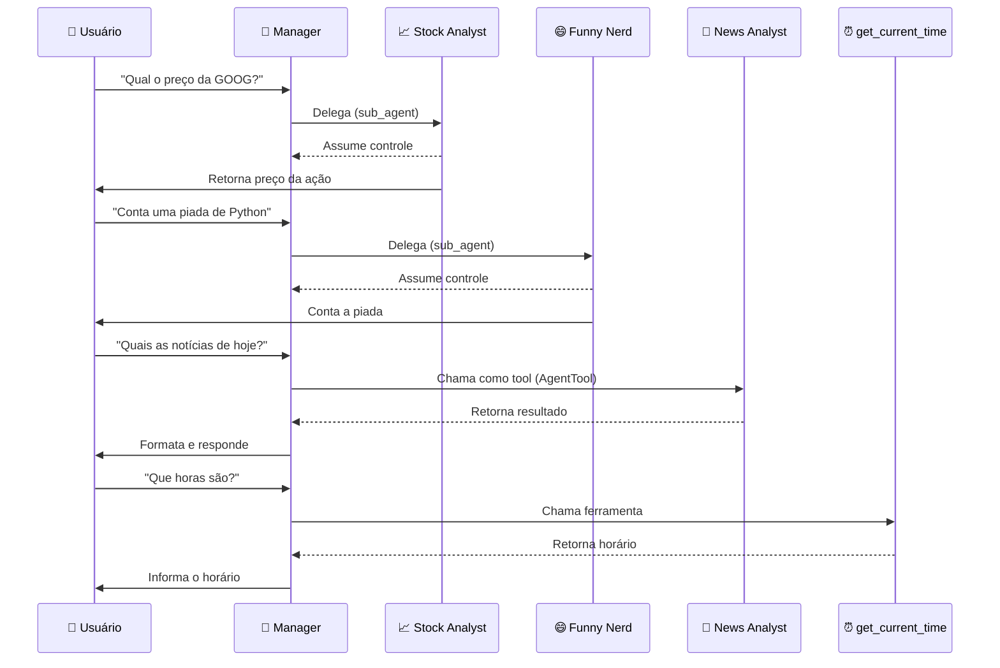

# Diagrama Multi-Agent System

Este diagrama representa a estrutura hierárquica do sistema multi-agente implementado na pasta `7-multi-agent`.

## Visão Geral da Arquitetura

## Legenda

| Tipo de Conexão | Descrição |
|-----------------|-----------|
| `→` (seta sólida) | **Sub-Agent**: Delegação completa - o sub-agente assume o controle da resposta |
| `⇢` (seta pontilhada) | **AgentTool**: O agente é usado como ferramenta - retorna resultado ao manager |

## Estrutura de Arquivos

## Fluxo de Interação

## Resumo dos Agentes

| Agente | Tipo | Função | Tools |
|--------|------|--------|-------|
| **manager** | Root Agent | Coordena e delega tarefas | `AgentTool(news_analyst)`, `get_current_time` |
| **stock_analyst** | Sub-Agent | Análise de preços de ações | `get_stock_price()` |
| **funny_nerd** | Sub-Agent | Conta piadas nerds | `get_nerd_joke()` |
| **news_analyst** | AgentTool | Busca e analisa notícias | `google_search` |
