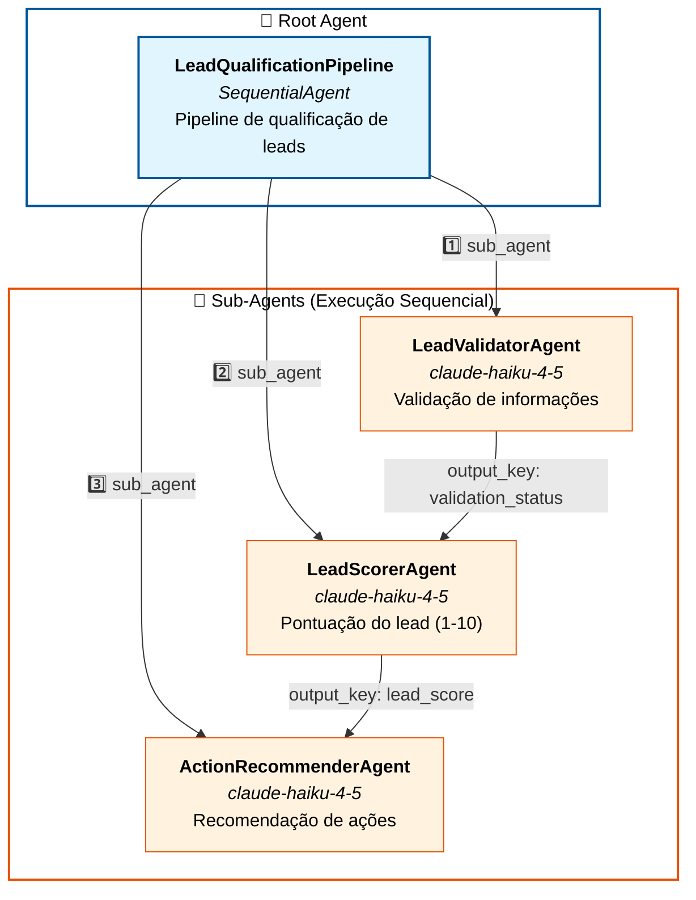

# Diagrama de Arquitetura - Sequential Agent

## Fluxo de Execução

1. **LeadValidatorAgent**: Recebe as informações do lead e valida se estão completas
   - Saída: `validation_status` (valid/invalid)

2. **LeadScorerAgent**: Analisa o lead e atribui uma pontuação de 1-10
   - Saída: `lead_score` (pontuação + justificativa)

3. **ActionRecommenderAgent**: Recomenda ações baseadas na validação e pontuação
   - Saída: `action_recommendation` (recomendação para equipe de vendas)
