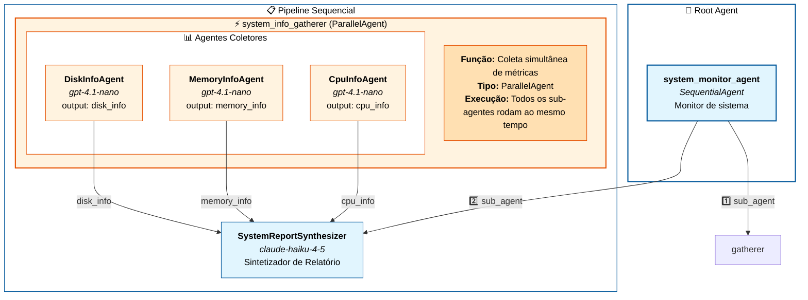

# Diagrama de Arquitetura - Parallel Agent (System Monitor)



---

## 🔄 O que é o `system_info_gatherer`?

O **`system_info_gatherer`** é um **ParallelAgent** — um tipo especial de agente orquestrador que executa múltiplos sub-agentes **simultaneamente** ao invés de sequencialmente.

### Características Principais

| Propriedade | Valor |
|-------------|-------|
| **Nome** | `system_info_gatherer` |
| **Tipo** | `ParallelAgent` |
| **Modelo LLM** | Nenhum (apenas orquestra) |
| **Sub-agentes** | 3 agentes coletores |
| **Execução** | Paralela (simultânea) |

### Função no Pipeline

```
📥 Usuário solicita relatório do sistema
         ↓
    ┌────────────────────────────────────┐
    │     system_info_gatherer           │
    │        (ParallelAgent)             │
    ├────────────────────────────────────┤
    │  Executa SIMULTANEAMENTE:          │
    │                                    │
    │  ┌──────────┐ ┌──────────┐ ┌──────────┐
    │  │ CPU Info │ │ Memory   │ │ Disk     │
    │  │  Agent   │ │ Info     │ │ Info     │
    │  │ (GPT)    │ │ (GPT)    │ │ (GPT)    │
    │  └────┬─────┘ └────┬─────┘ └────┬─────┘
    │       │            │            │
    │       ▼            ▼            ▼
    │   cpu_info    memory_info   disk_info
    │       │            │            │
    └───────┴────────────┴────────────┘
                    ↓
         (dados salvos no estado)
                    ↓
    ┌────────────────────────────────────┐
    │   SystemReportSynthesizer          │
    │         (Claude)                   │
    │   Combina: {cpu_info}              │
    │            {memory_info}           │
    │            {disk_info}             │
    └────────────────────────────────────┘
                    ↓
📤 Relatório consolidado para o usuário
```

### Por que usar Parallel ao invés de Sequential?

| Aspecto | Sequential | Parallel (atual) |
|---------|-----------|------------------|
| **Tempo** | CPU → Memory → Disk (soma dos tempos) | Todos ao mesmo tempo |
| **Eficiência** | Mais lento | ~3x mais rápido |
| **Dependência** | Um agente pode depender do anterior | Agentes independentes |
| **Uso ideal** | Quando há dependência entre etapas | Quando tarefas são independentes |

### Modelos Utilizados

| Agente | Modelo | Justificativa |
|--------|--------|---------------|
| **CpuInfoAgent** | `gpt-4.1-nano` | Tarefas simples de coleta |
| **MemoryInfoAgent** | `gpt-4.1-nano` | Tarefas simples de coleta |
| **DiskInfoAgent** | `gpt-4.1-nano` | Tarefas simples de coleta |
| **SystemReportSynthesizer** | `claude-haiku-4-5` | Síntese complexa de múltiplas fontes |

> **💡 Estratégia**: Modelos menores e mais baratos (GPT nano) para coleta paralela de dados, modelo mais capaz (Claude) para a síntese final que requer compreensão mais profunda.
