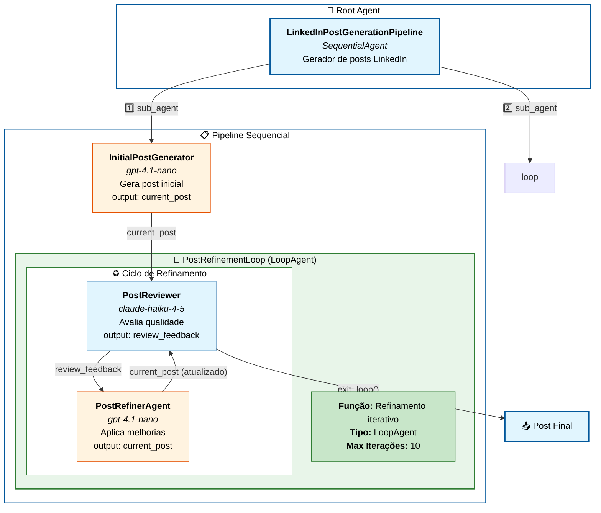

# Diagrama de Arquitetura - Loop Agent (LinkedIn Post Generator)



---

## 🎨 Legenda de Cores por Modelo

| Cor | Modelo | Agentes |
|-----|--------|---------|
| 🟠 Laranja | **GPT** (`gpt-4.1-nano`) | InitialPostGenerator, PostRefinerAgent |
| 🔵 Azul | **Claude** (`claude-haiku-4-5`) | PostReviewer |
| 🟢 Verde | **LoopAgent** (orquestrador) | PostRefinementLoop |

---

## 🔄 O que é um LoopAgent?

O **LoopAgent** é um tipo de orquestrador que executa seus sub-agentes **repetidamente** em ciclo até que uma condição de saída seja atingida ou o número máximo de iterações seja alcançado.

### Características Principais

| Propriedade | Valor |
|-------------|-------|
| **Nome** | `PostRefinementLoop` |
| **Tipo** | `LoopAgent` |
| **Max Iterações** | 10 |
| **Sub-agentes** | Reviewer (Claude) → Refiner (GPT) |
| **Condição de Saída** | Chamada da função `exit_loop()` |

---

## 📊 Fluxo de Execução

```
📥 Usuário solicita geração de post
         ↓
┌────────────────────────────────────┐
│   InitialPostGenerator (GPT)       │
│   Gera o rascunho inicial          │
│   output: current_post             │
└────────────────────────────────────┘
         ↓
┌────────────────────────────────────────────────────────┐
│              PostRefinementLoop (LoopAgent)            │
│                                                        │
│   ┌──────────────────────────────────────────────┐    │
│   │  Iteração 1, 2, 3... (até 10x)               │    │
│   │                                              │    │
│   │  ┌─────────────────┐                         │    │
│   │  │  PostReviewer   │◄─────────────────┐      │    │
│   │  │  (CLAUDE)       │                  │      │    │
│   │  │  Avalia post    │                  │      │    │
│   │  │  Usa tools:     │                  │      │    │
│   │  │  - count_chars  │                  │      │    │
│   │  │  - exit_loop    │                  │      │    │
│   │  └────────┬────────┘                  │      │    │
│   │           │                           │      │    │
│   │           ▼                           │      │    │
│   │     ┌─────────────┐                   │      │    │
│   │     │ Post OK?    │───SIM───► exit_loop()    │    │
│   │     └──────┬──────┘                          │    │
│   │            │ NÃO                             │    │
│   │            ▼                                 │    │
│   │  ┌─────────────────┐                         │    │
│   │  │ PostRefiner     │                         │    │
│   │  │ (GPT)           │                         │    │
│   │  │ Aplica feedback │─────────────────────────┘    │
│   │  └─────────────────┘                              │
│   │                                                   │
│   └───────────────────────────────────────────────────┘
│                                                        │
└────────────────────────────────────────────────────────┘
         ↓
📤 Post final refinado para o usuário
```

---

## 🧠 Estratégia de Modelos

| Agente | Modelo | Justificativa |
|--------|--------|---------------|
| **InitialPostGenerator** | GPT | Geração criativa de conteúdo |
| **PostReviewer** | Claude | Avaliação crítica e uso de ferramentas |
| **PostRefinerAgent** | GPT | Aplicação de melhorias no texto |

> **💡 Lógica**: O **Claude** é usado para **avaliar criticamente** o conteúdo e decidir quando encerrar o loop, enquanto o **GPT** é usado para tarefas **criativas de escrita** (gerar e refinar o post).

---

## 🛠️ Ferramentas do Reviewer

O agente revisor (Claude) possui duas ferramentas:

| Ferramenta | Função |
|------------|--------|
| `count_characters()` | Verifica se o post está entre 1000-1500 caracteres |
| `exit_loop()` | Encerra o loop quando o post atinge todos os requisitos |

---

## 🔁 Comparativo com Outros Padrões

| Padrão | Execução | Uso Ideal |
|--------|----------|-----------|
| **Sequential** | A → B → C (uma vez) | Pipeline linear com dependências |
| **Parallel** | A, B, C (simultâneo) | Tarefas independentes |
| **Loop** | (A → B) × N (repetido) | Refinamento iterativo até atingir qualidade |
