# Sistema Multi-Agentes - Stateful Customer Service

Este diagrama representa a hierarquia do sistema multi-agentes da pasta `8-stateful-multi-agent`.

## Diagrama Mermaid

```mermaid
flowchart TB
    subgraph RootAgent["🤖 Root Agent"]
        manager["<b>customer_service</b><br/><i>gemini-2.0-flash</i><br/>Atendimento ao cliente"]
    end

    subgraph SubAgents["👥 Sub-Agents"]
        policy["<b>policy_agent</b><br/><i>gemini-2.0-flash</i><br/>Políticas e diretrizes"]
        sales["<b>sales_agent</b><br/><i>gemini-2.0-flash</i><br/>Vendas de cursos"]
        course["<b>course_support</b><br/><i>gemini-2.0-flash</i><br/>Suporte ao curso"]
        order["<b>order_agent</b><br/><i>gemini-2.0-flash</i><br/>Pedidos e reembolsos"]
    end

    subgraph SalesTools["🔧 Tools do Sales Agent"]
        purchase["purchase_course()"]
    end

    subgraph OrderTools["🔧 Tools do Order Agent"]
        refund["refund_course()"]
        time["get_current_time()"]
    end

    manager -->|sub_agents| policy
    manager -->|sub_agents| sales
    manager -->|sub_agents| course
    manager -->|sub_agents| order

    sales -->|tools| purchase
    order -->|tools| refund
    order -->|tools| time

    style RootAgent fill:#1a1a2e,stroke:#4a9eff,stroke-width:2px
    style manager fill:#2d3748,stroke:#4a9eff,stroke-width:2px,color:#fff
    style SubAgents fill:#1a1a2e,stroke:#9f7aea,stroke-width:2px
    style policy fill:#2d3748,stroke:#9f7aea,stroke-width:1px,color:#fff
    style sales fill:#2d3748,stroke:#9f7aea,stroke-width:1px,color:#fff
    style course fill:#2d3748,stroke:#9f7aea,stroke-width:1px,color:#fff
    style order fill:#2d3748,stroke:#9f7aea,stroke-width:1px,color:#fff
    style SalesTools fill:#1a1a2e,stroke:#f6ad55,stroke-width:2px
    style OrderTools fill:#1a1a2e,stroke:#f6ad55,stroke-width:2px
    style purchase fill:#2d3748,stroke:#f6ad55,stroke-width:1px,color:#fff
    style refund fill:#2d3748,stroke:#f6ad55,stroke-width:1px,color:#fff
    style time fill:#2d3748,stroke:#f6ad55,stroke-width:1px,color:#fff
```

## Estrutura Detalhada

| Agente | Modelo | Função | Tools |
|--------|--------|--------|-------|
| **customer_service** (Root) | gemini-2.0-flash | Agente principal de atendimento ao cliente | Nenhuma |
| **policy_agent** | gemini-2.0-flash | Políticas da comunidade e cursos | Nenhuma |
| **sales_agent** | gemini-2.0-flash | Vendas do curso AI Marketing Platform | `purchase_course()` |
| **course_support** | gemini-2.0-flash | Suporte ao conteúdo do curso | Nenhuma |
| **order_agent** | gemini-2.0-flash | Histórico de compras e reembolsos | `refund_course()`, `get_current_time()` |

## Estado Compartilhado

O sistema utiliza **state management** com os seguintes campos:

- `user_name`: Nome do usuário
- `purchased_courses`: Lista de cursos comprados (objetos com `id` e `purchase_date`)
- `interaction_history`: Histórico de interações com timestamps

## Fluxo de Dados

1. O **customer_service** recebe a mensagem do usuário
2. Analisa o contexto e delega para o sub-agente apropriado
3. Os sub-agentes podem modificar o state através de suas tools
4. O state é persistido na sessão para continuidade da conversa
